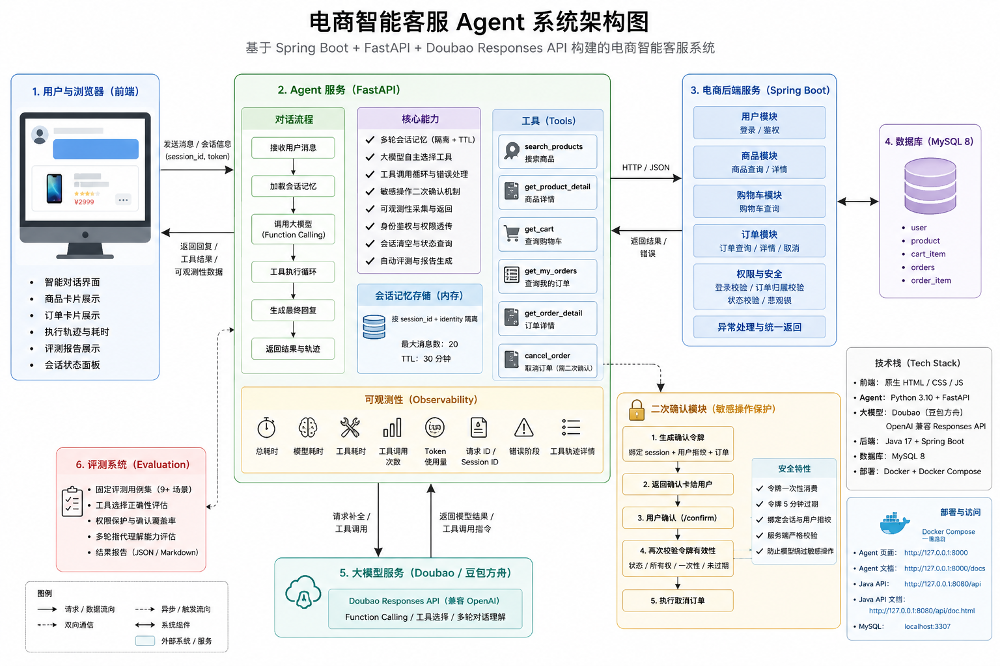

# OrderMate 电商智能客服

OrderMate 是一个面向学习、面试与原型验证的电商智能客服项目。Spring Boot 负责用户、商品、购物车和订单等业务规则，FastAPI Agent 负责模型调用、工具编排、上下文状态、SSE 流式响应和高风险操作确认。

> 当前定位：可在本地完整运行的演示系统，不建议未经安全加固直接承载真实用户或真实订单。



## 核心能力

- 商品搜索、详情、价格、库存等事实通过业务工具查询，避免模型直接编造。
- 登录后可查询购物车与订单，并执行加购、修改数量、下单、支付、取消等操作。
- 下单、支付、取消订单等高风险动作需要用户明确确认。
- 支持 SSE 流式事件与前端工具调用时间线。
- 支持多轮商品、购物车和订单指代状态。
- 支持本地知识库检索；实时价格、库存和订单始终以 Java API 为准。
- 默认 demo 模式无需模型 Key；live 模式支持 OpenAI-compatible API（包括 DeepSeek）。
- Redis 为可选能力；未配置时使用进程内存保存会话状态。

## 技术栈

| 层级 | 技术 |
| --- | --- |
| 业务后端 | Java 17、Spring Boot 3.1.5、Spring Security、JPA、JWT |
| Agent 服务 | Python 3.12、FastAPI、LangGraph、OpenAI Python SDK |
| 数据 | MySQL 8、可选 Redis、轻量知识库 |
| 前端 | FastAPI 静态页面、原生 JavaScript、SSE |
| 交付 | Docker、Docker Compose、GitHub Actions |

## 最快启动

前置条件：安装并启动 Docker Desktop。

```powershell
git clone https://github.com/guo-jinhong/ordermate.git
cd ordermate
docker compose up --build -d
docker compose ps
```

默认访问地址：

- 聊天页面：<http://localhost:8000>
- Agent API：<http://localhost:8000/docs>
- Java API：<http://localhost:8080/api/doc.html>

演示账号：

```text
用户名：testuser
密码：password
```

默认 Compose 启动 3 个服务：`mysql`、`backend`、`agent`。Redis 不在默认 Compose 中；只有显式配置可访问的 `REDIS_URL` 时才启用 Redis 持久状态。

完整的首次使用步骤、演示问题、停止和重置方式见 [QUICKSTART.md](QUICKSTART.md)。

## 运行模式

| 模式 | 是否需要模型 Key | 用途 |
| --- | --- | --- |
| `demo` | 否 | 稳定、可复现的本地演示 |
| `live` | 是 | 真实模型工具调用与多轮联调 |
| `auto` | 可选 | 有 Key 时使用 live，否则使用 demo |

切换 live 模式前复制示例配置，真实 Key 只能放在未跟踪的 `.env` 中：

```powershell
Copy-Item .env.docker.example .env
```

DeepSeek 示例：

```dotenv
AGENT_MODE=live
OPENAI_API_KEY=在本地填写真实Key
OPENAI_MODEL=填写当前可用的DeepSeek模型名
OPENAI_BASE_URL=https://api.deepseek.com
```

不要把 `.env`、日志、数据库文件或真实访问令牌提交到 GitHub。

## 项目结构

```text
.
├── src/                         Spring Boot 业务后端
├── agent-service/               FastAPI Agent、前端、测试与知识库
├── docs/                        架构、开发、API、部署、安全与测试文档
├── images/                      架构与安全流程图
├── docker-compose.yml           MySQL、backend、agent 编排
├── start-demo.ps1               Docker 演示启动脚本
├── start-local-full.ps1         Windows 本地进程完整启动脚本
└── QUICKSTART.md                首次运行教学
```

## 架构边界

- Java 后端拥有业务事实、权限和事务边界。
- Agent 负责理解请求、选择工具和组织回答，不绕过 Java API 直接写业务表。
- MySQL 保存用户、商品、购物车和订单等持久数据。
- Redis 仅用于可选的会话、状态、确认令牌与工作流检查点持久化。
- 本地知识库回答售后、规则和产品说明；价格和库存仍查询业务接口。

详细说明见 [docs/architecture.md](docs/architecture.md) 和 [docs/agent-rules.md](docs/agent-rules.md)。

## 测试

```powershell
# Java
.\mvnw.cmd test

# Python
agent-service\.venv\Scripts\python.exe -m pytest -q agent-service\tests
```

最近一次本地验证（2026-08-08）：

- Java：26 passed
- Python：120 passed，1 个第三方弃用警告
- Compose 配置：可解析出 `mysql`、`backend`、`agent`

测试范围与手工验收清单见 [docs/test-plan.md](docs/test-plan.md)。

## 文档导航

| 文档 | 内容 |
| --- | --- |
| [QUICKSTART.md](QUICKSTART.md) | 第一次启动、演示、停止和重置 |
| [docs/architecture.md](docs/architecture.md) | 架构、数据流和系统边界 |
| [docs/development.md](docs/development.md) | Java/Python 本地开发环境与脚本参数 |
| [docs/api-design.md](docs/api-design.md) | Agent 与 Java API 设计及前端联调 |
| [docs/deployment.md](docs/deployment.md) | Docker、服务器、Nginx、HTTPS、升级和回滚 |
| [docs/security.md](docs/security.md) | 密钥、网络、数据与模型安全要求 |
| [docs/test-plan.md](docs/test-plan.md) | 自动测试结果与手工验收清单 |
| [docs/roadmap.md](docs/roadmap.md) | 后续优化方向 |
| [agent-service/README.md](agent-service/README.md) | Agent 单独开发与工具说明 |

## 已知限制

- 默认 Compose 不包含 Redis，Agent 重启后内存态会话不会保留。
- demo 数据和账号仅用于本地演示。
- live 模式依赖模型服务的网络、配额和兼容性。
- 当前没有数据库版本迁移工具，生产化前应引入 Flyway 或 Liquibase。
- 尚未完成真实公网部署、备份恢复和压力测试验收。

## 安全与许可

公开仓库前请阅读 [docs/security.md](docs/security.md)。当前仓库尚未选择开源许可证；在添加明确许可证前，代码默认保留全部权利。后续若决定允许复用，可再选择 MIT、Apache-2.0 或其他许可证。
