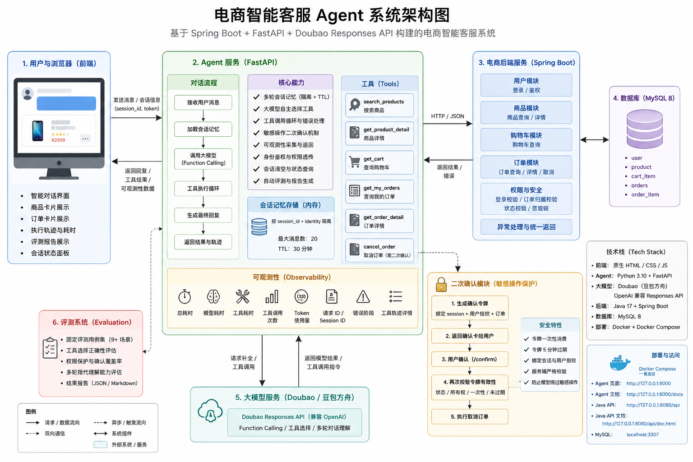

# OrderMate 电商智能客服

OrderMate 是一个面向学习、面试与原型验证的电商智能客服项目。Spring Boot 负责用户、商品、购物车和订单等业务规则，FastAPI Agent 负责模型调用、工具编排、上下文状态、SSE 流式响应和高风险操作确认。

> 当前定位：可在本地完整运行的演示系统，不建议未经安全加固直接承载真实用户或真实订单。



## 核心能力

- 商品搜索、详情、价格、库存等事实通过业务工具查询，避免模型直接编造。
- 登录后可查询购物车与订单，并执行加购、修改数量、下单、支付、取消等操作。
- 下单、支付、取消订单等高风险动作需要用户明确确认。
- 支持 SSE 流式事件与前端工具调用时间线。
- 默认客户视角隐藏内部工具细节，开发者视角通过脱敏 Inspector 展示执行过程。
- 支持多轮商品、购物车和订单指代状态。
- 支持本地知识库检索；实时价格、库存和订单始终以 Java API 为准。
- 默认 `auto` 模式优先使用已配置的 OpenAI-compatible 模型（包括 DeepSeek）；未配置 Key 时使用 demo；运行中失败不会重放业务流程，可在模型调用内部切换配置的备用模型。
- Redis 为可选能力；未配置时使用进程内存保存会话状态。

## 技术栈

| 层级 | 技术 |
| --- | --- |
| 业务后端 | Java 17、Spring Boot 3.1.5、Spring Security、JPA、JWT |
| Agent 服务 | Python 3.12、FastAPI、LangGraph、OpenAI Python SDK |
| 数据 | MySQL 8、可选 Redis、轻量知识库 |
| 前端 | Vue 3 + Vite（主入口）、FastAPI 原生静态页面（回退入口） |
| 交付 | Docker、Docker Compose、GitHub Actions |

## 最快启动

前置条件：安装并启动 Docker Desktop。

```powershell
git clone https://github.com/guo-jinhong/ordermate.git
cd ordermate
docker compose up --build -d
docker compose ps
```

默认访问地址：

- 聊天页面：<http://localhost:8000>
- Agent API：<http://localhost:8000/docs>
- Java API：<http://localhost:8080/api/doc.html>

演示账号：

```text
用户名：testuser
密码：password
```

默认 Compose 启动 4 个服务：`mysql`、`backend`、`agent`、`frontend`。Redis 不在默认 Compose 中；只有显式配置可访问的 `REDIS_URL` 时才启用 Redis 持久状态。

访问地址：

- Vue 主入口：<http://localhost:8081>
- 原生回退入口：<http://localhost:8081/legacy/>
- Agent API：<http://localhost:8000/docs>
- Java API：<http://localhost:8080/api/doc.html>

> 生产环境建议不映射 agent 端口（8000），仅通过 frontend Nginx 反代访问。默认使用 `PUBLIC_READONLY=false`，登录用户可正常操作自己的购物车和订单；需要只读展示时可显式设置为 `true`。

完整的首次使用步骤、演示问题、停止和重置方式见 [QUICKSTART.md](QUICKSTART.md)。

## 本机 ngrok 临时演示记录（2026-10-01）

这套面试演示不使用 Docker、服务器或自购域名：Windows 本机运行 Java、FastAPI Agent 和 Vue，另用 ngrok 将 **FastAPI 的 `127.0.0.1:8000` 单一入口**临时分享出去；MySQL、Java API 和 Vite `5173` 不单独建立公网隧道。启动脚本使用 `-PublicDemo` 时强制 `AGENT_MODE=live`、`PUBLIC_DEMO=true`、`PUBLIC_READONLY=false`；ngrok 由单独进程启动，关闭它即可停止公网转发。

双击根目录的 [一键启动公网.bat](一键启动公网.bat)，会先以 `-PublicDemo` 模式重新构建 Vue、启动并检查本地服务，再启动 ngrok。普通的 [一键启动Vue.bat](一键启动Vue.bat) 仍只用于本地开发，不会自动开放公网。可在本地 `.env` 中配置 `NGROK_DOMAIN` 为自己的 ngrok 域名（也可传入 `-Domain`）；未配置时沿用当前演示域名。隧道启动前必须确认 `/health` 返回 `public_demo=true` 且为 live 模式。如果目标隧道已经运行，公网快捷命令会复用它并显示网址，不会重复启动。新启动的 ngrok 运行在快捷命令窗口里，关闭该窗口或按 Ctrl+C 即停止公网访问；若复用了原有隧道，则须关闭原 ngrok 进程。本地服务在后台运行，日志位于 `.runtime`；停止时只结束属于本项目的进程。启动器遇到无法确认归属的端口占用会停止并提示，不会直接杀掉无关服务。

本次使用的隧道命令参数为 `ngrok http 127.0.0.1:8000 --inspect=false --log stdout --log-format json`；ngrok 连接令牌只保存在本机，不交给访客。重新启动后先确认实际分配的网址。

记录时本机 `/health` 为 `ok`，ngrok 本地 API 显示隧道指向 `http://127.0.0.1:8000`，公开网址为 <https://lesia-unfrightening-leone.ngrok-free.dev>。这是 **2026-10-01 的快照**，日后使用前须重新确认服务和隧道仍在线，不要把旧网址当作永久可用地址。此前手机移动网络曾完成页面、登录和聊天验收；后来又反馈演示账号无法登录，原因尚未重新核实。

当前演示安全边界：

- 公网页面和 `/health` 可以被任何知道网址的人打开；ngrok 首次访问提示页不是身份验证。普通聊天、商品推荐和售后规则咨询可匿名体验；个人订单、购物车和写操作须登录，公网登录默认只允许 `interview_demo`（由 `DEMO_ALLOWED_USERS` 控制）。**不要把密码、模型 Key 或 ngrok 令牌写入仓库。**
- 公网只放行 Vue 静态资源及必要的登录、会话、聊天、确认、清会话请求；管理、调试和其他接口不通过该入口开放。
- 演示账号使用正常用户权限，操作该账号的购物车和订单。加购、改数量、移除商品直接执行；清空购物车、创建订单、支付和取消订单先确认再执行。多人使用同一账号时，共享该账号的数据。`PUBLIC_READONLY=true` 仅用于主动选择只读展示的场景。
- 聊天默认限额为每日 30 次、同时 2 个请求；限额保存在 Agent 进程内存，重启会重置，不是长期防刷方案。

### 查看访客来源与封禁 IP

1. 云端访问记录：[ngrok Traffic Inspector](https://dashboard.ngrok.com/traffic-inspector)。先点开单条请求详情查看可用元数据。ngrok 免费账户的云端记录默认保留 24 小时；默认只存请求/响应元数据，不要为了找 IP 贸然开启会保存请求头和请求体的 **Full Capture**，其中可能包含密码或令牌。[官方说明](https://ngrok.com/docs/obs/traffic-inspection)
2. 本机 `http://127.0.0.1:4040` 检查页在开启请求检查时可显示请求时间、路径和 **Source IP**。当前隧道的 `inspect` 为 `false`（此前用 `--inspect=false` 启动），因此本机不会捕获请求明细，也无法补回此前的记录。如确需查来源 IP，先重启 ngrok 并去掉该参数，再用手机移动网络访问一次，对照新请求；检查页也可能记录敏感请求内容，用完后应关闭检查。[官方说明](https://ngrok.com/docs/gateway/agent/web-inspection-interface)
3. IP 名单入口：[ngrok IP Policies](https://dashboard.ngrok.com/ip-policies)（Dashboard → Security → IP Policies）。单个 IPv4 用 `/32`，单个 IPv6 用 `/128`。**创建 `deny` 规则后还必须通过 Traffic Policy 的 `restrict-ips` 动作应用到当前 Agent Endpoint**，仅保存名单不会拦截；此前搭建流程未设置 IP 封禁，若之后自行修改应以 ngrok 当前配置为准。应用前应先测试自己的访问不会被误拦。[官方步骤](https://ngrok.com/docs/gateway/traffic-policy/concepts/ip-policies)
4. IP 只能代表网络出口，不能准确识别个人；移动网络、公司网络可能共享或变化。遇到异常访问先核对请求路径、频率和来源，再决定是否封禁；紧急情况下可直接停止 ngrok。账号权限和聊天限额仍需保留，不能只靠 IP 黑名单。

后续再处理：先排查 `interview_demo` 当前登录失败的原因；如需要封禁，先取得可确认的来源 IP，再配置并验证 Traffic Policy。`users` 表位于 `ecommerce_db`，密码列是 BCrypt 哈希，优先通过本机注册接口创建演示账号，不要直接写明文密码；新增用户名还需同步加入 `DEMO_ALLOWED_USERS`。

## 运行模式

| 模式 | 是否需要模型 Key | 用途 |
| --- | --- | --- |
| `demo` | 否 | 稳定、可复现的本地演示 |
| `live` | 是 | 真实模型工具调用与多轮联调 |
| `auto` | 可选 | 有 Key 时使用 live；无 Key 时使用 demo；运行失败不重放业务 |

切换 live 模式前复制示例配置，真实 Key 只能放在未跟踪的 `.env` 中：

```powershell
Copy-Item .env.docker.example .env
```

DeepSeek 示例：

```dotenv
AGENT_MODE=live
OPENAI_API_KEY=在本地填写真实Key
OPENAI_MODEL=填写当前可用的DeepSeek模型名
OPENAI_BASE_URL=https://api.deepseek.com
```

聊天模型与 Embedding 使用独立配置。DeepSeek 只承担推理时，不要把其 Chat Base URL 复用于 `text-embedding-3-small`；未配置 `EMBEDDING_API_KEY` 时知识库使用词法检索。

不要把 `.env`、日志、数据库文件或真实访问令牌提交到 GitHub。

## 项目结构

```text
.
├── src/                         Spring Boot 业务后端
├── agent-service/               FastAPI Agent、原生前端、测试与知识库
├── frontend/                    Vue 3 + Vite 前端（主入口）
├── docs/                        架构、开发、API、部署、安全与测试文档
├── images/                      架构与安全流程图
├── docker-compose.yml           MySQL、backend、agent、frontend 编排
├── start-dev-stack.ps1          Windows 本地开发一键启动（Java+Agent+Vue）
├── 一键启动公网.bat              Windows 本机公网演示（构建并启动服务后打开 ngrok）
├── start-ngrok-tunnel.ps1       公网快捷命令调用的 ngrok 隧道脚本
└── QUICKSTART.md                首次运行教学
```

## 架构边界

- Java 后端拥有业务事实、权限和事务边界。
- Agent 负责理解请求、选择工具和组织回答，不绕过 Java API 直接写业务表。
- MySQL 保存用户、商品、购物车和订单等持久数据。
- Redis 仅用于可选的会话、状态、确认令牌与工作流检查点持久化。
- 本地知识库回答售后、规则和产品说明；价格和库存仍查询业务接口。

详细说明见 [docs/architecture.md](docs/architecture.md) 和 [docs/agent-rules.md](docs/agent-rules.md)。

## 测试

```powershell
# Java
.\mvnw.cmd test

# Python
agent-service\.venv\Scripts\python.exe -m pytest -q agent-service\tests
```

最近一次本地验证（2026-09-28）：

- Java：28 passed
- Python：155 passed（分组验证），1 个第三方弃用警告
- Vue：141 passed，另有 5 项生产产物契约测试
- Compose 配置：可解析出 `mysql`、`backend`、`agent`、`frontend`

测试范围与手工验收清单见 [docs/test-plan.md](docs/test-plan.md)。

## 文档导航

| 文档 | 内容 |
| --- | --- |
| [QUICKSTART.md](QUICKSTART.md) | 第一次启动、演示、停止和重置 |
| [docs/architecture.md](docs/architecture.md) | 架构、数据流和系统边界 |
| [docs/development.md](docs/development.md) | Java/Python 本地开发环境与脚本参数 |
| [docs/api-design.md](docs/api-design.md) | Agent 与 Java API 设计及前端联调 |
| [docs/deployment.md](docs/deployment.md) | Docker、服务器、Nginx、HTTPS、升级和回滚 |
| [docs/security.md](docs/security.md) | 密钥、网络、数据与模型安全要求 |
| [docs/test-plan.md](docs/test-plan.md) | 自动测试结果与手工验收清单 |
| [docs/frontend-showcase.md](docs/frontend-showcase.md) | 前端设计决策、面试演示路线与验收标准 |
| [docs/frontend-vue-plan.md](docs/frontend-vue-plan.md) | Vue 前端的实施规范、类型契约、部署接入与任务拆分 |
| [docs/roadmap.md](docs/roadmap.md) | 后续优化方向 |
| [agent-service/README.md](agent-service/README.md) | Agent 单独开发与工具说明 |

## 已知限制

- 默认 Compose 不包含 Redis，Agent 重启后内存态会话不会保留。
- demo 数据和账号仅用于本地演示。
- live 模式依赖模型服务的网络、配额和兼容性。
- 当前没有数据库版本迁移工具，生产化前应引入 Flyway 或 Liquibase。
- 公网部署已完成安全门禁（`/admin`、`/metrics` 禁公网、Nginx 限流、Uvicorn 仅信任代理头、`PUBLIC_READONLY` 写操作隔离），演示账号与正常用户权限一致，只能操作本账号的数据，高风险操作须二次确认。

## 安全与许可

公开仓库前请阅读 [docs/security.md](docs/security.md)。当前仓库尚未选择开源许可证；在添加明确许可证前，代码默认保留全部权利。后续若决定允许复用，可再选择 MIT、Apache-2.0 或其他许可证。
