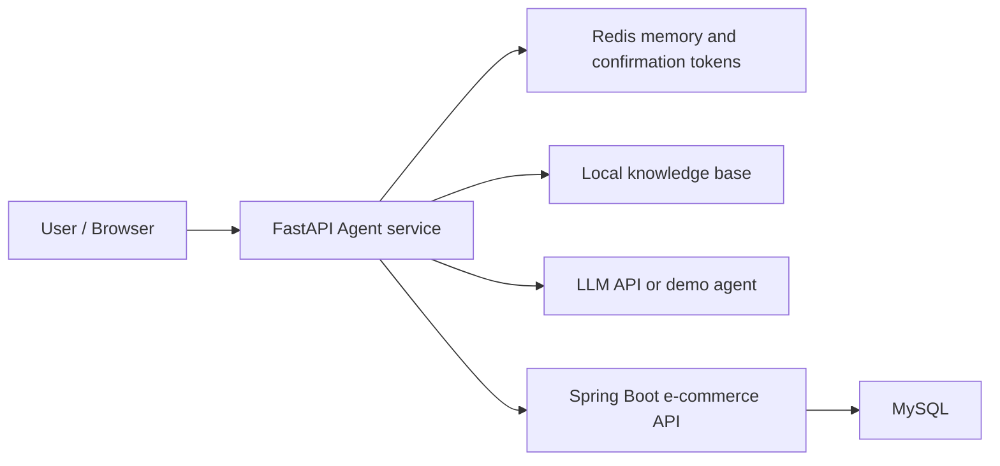
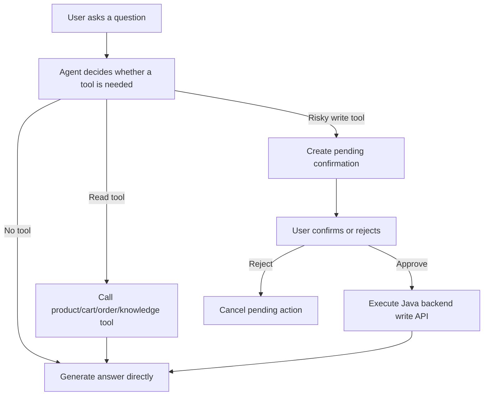

# API Design

## 1. Overview

This project contains two backend services:

- Java backend: Spring Boot e-commerce order system, mounted under `/api`.
- Agent backend: FastAPI customer-service Agent, mounted at the root path of port `8000`.

Recommended local addresses:

| Service | Base URL | Docs |
| --- | --- | --- |
| Agent service | `http://localhost:8000` | `http://localhost:8000/docs` |
| E-commerce backend | `http://localhost:8080/api` | `http://localhost:8080/api/doc.html` |

The frontend chat page calls the Agent service first. The Agent service then calls the Java backend through tool functions when it needs real business data such as products, cart items, or orders.



## 2. Common Conventions

### 2.1 Response Envelope

The Java backend uses a unified response body:

```json
{
  "code": 200,
  "message": "success",
  "data": {}
}
```

The Agent service returns task-specific JSON models. For example, `/chat` returns:

```json
{
  "answer": "Here is the answer.",
  "tool_calls": [],
  "confirmation": null,
  "data": null,
  "reference": null
}
```

### 2.2 Authentication

Java protected APIs require a JWT in the request header:

```http
Authorization: Bearer <access_token>
```

The Agent service accepts the same token in the request body as `access_token`, then forwards it to the Java backend when calling protected tools.

### 2.3 Status Codes

| Code | Meaning | Typical Scenario |
| --- | --- | --- |
| `200` | Success | Query, login, chat, confirmation succeeded |
| `400` | Bad request | Invalid parameter or unsupported pending action |
| `401` | Unauthorized | Missing token or login failed |
| `403` | Forbidden | Non-admin user accesses admin API |
| `404` | Not found | Resource not found or confirmation token expired |
| `422` | Validation error | FastAPI/Pydantic request validation failed |
| `500` | Server error | Unexpected backend error |
| `502` | Upstream error | Agent failed to execute e-commerce API operation |
| `503` | Service unavailable | Live Agent mode enabled but model API key is missing |

### 2.4 API Versioning

The current project does not use `/api/v1` on the Agent side. If this project is upgraded for production, recommended paths are:

- `/api/v1/chat`
- `/api/v1/chat/stream`
- `/api/v1/auth/login`
- `/api/v1/confirm`
- `/api/v1/conversation/clear`

For the current demo, keep existing paths to avoid breaking the frontend.

## 3. Agent Service APIs

### 3.1 Health Check

```http
GET /health
```

Purpose: check whether the Agent service is alive and which mode is active.

Response:

```json
{
  "status": "ok",
  "model_configured": true,
  "agent_mode": "demo",
  "backend_base_url": "http://backend:8080/api"
}
```

Notes:

- `agent_mode=demo`: uses deterministic local demo logic, no model API key required.
- `agent_mode=live`: calls the configured LLM API.

### 3.2 Login Proxy

```http
POST /auth/login
Content-Type: application/json
```

Request:

```json
{
  "username": "testuser",
  "password": "password"
}
```

Response:

```json
{
  "access_token": "<jwt>",
  "token_type": "bearer"
}
```

Design note: the Agent service does not issue its own login token. It proxies login to the Java backend and returns the Java JWT, so all order/cart tools share the same business identity.

### 3.3 Normal Chat

```http
POST /chat
Content-Type: application/json
```

Request:

```json
{
  "message": "推荐 3000 元以内的手机",
  "session_id": "browser-session-001",
  "access_token": null
}
```

Response:

```json
{
  "answer": "可以考虑 Smartphone X ...",
  "tool_calls": [
    {
      "name": "search_products",
      "arguments": {
        "keyword": "手机"
      },
      "outcome": "success"
    }
  ],
  "confirmation": null,
  "data": [],
  "reference": null
}
```

Core behavior:

- Reads short-term conversation memory by `session_id + token fingerprint`.
- Adds structured state context such as last order ID or last product keyword.
- Lets the Agent choose tools.
- Saves the user and assistant turn back to memory.
- Redacts sensitive text before writing memory.

### 3.4 Streaming Chat

```http
POST /chat/stream
Content-Type: application/json
Accept: text/event-stream
```

Request:

```json
{
  "message": "查询我的订单",
  "session_id": "browser-session-001",
  "access_token": "<jwt>"
}
```

SSE events:

```text
event: started
data: {"message":"正在理解你的问题"}

event: progress
data: {"message":"Agent 正在处理"}

event: tool
data: {"name":"get_my_orders","outcome":"success","arguments":{}}

event: result
data: {"answer":"...","tool_calls":[...]}
```

Design note: this endpoint is used by the frontend chat page. It improves user experience by showing the Agent execution timeline before the final answer is ready.

### 3.5 Confirm Pending Action

```http
POST /confirm
Content-Type: application/json
```

Request:

```json
{
  "session_id": "browser-session-001",
  "confirmation_token": "<confirmation_token>",
  "approved": true,
  "access_token": "<jwt>"
}
```

Response:

```json
{
  "status": "executed",
  "message": "订单已成功取消。",
  "data": {}
}
```

Used for high-risk operations such as cancelling an order.

Safety design:

- The Agent only creates a pending confirmation for `cancel_order`.
- The pending token is bound to session ID and login token fingerprint.
- The token is single-use.
- The token has a TTL.
- The actual write operation is executed only after explicit user confirmation.

### 3.6 Clear Conversation

```http
POST /conversation/clear
Content-Type: application/json
```

Request:

```json
{
  "session_id": "browser-session-001",
  "access_token": "<jwt>"
}
```

Response:

```json
{
  "status": "cleared",
  "cleared": true
}
```

Purpose: clear all memory and structured state under the given session.

## 4. Agent Tools

| Tool | Needs Login | Backend Dependency | Purpose |
| --- | --- | --- | --- |
| `search_knowledge_base` | No | Local knowledge files | Search product specs and after-sales policies |
| `search_products` | No | Java `/products/search` | Search real product data |
| `get_product_detail` | No | Java `/products/{id}` | Get real product detail |
| `get_cart` | Yes | Java `/shopping-cart` | Read user's cart |
| `get_my_orders` | Yes | Java `/orders` | Read user's order list |
| `get_order_detail` | Yes | Java `/orders/{id}` | Read order detail |
| `cancel_order` | Yes | Java `/orders/{id}/cancel` | Create confirmation first, then cancel after approval |

Tool execution rule:



## 5. Java E-commerce APIs

The Java backend is mounted under:

```text
http://localhost:8080/api
```

### 5.1 User APIs

| Method | Path | Auth | Description |
| --- | --- | --- | --- |
| `POST` | `/users/register` | No | Register a new user |
| `POST` | `/users/login` | No | Login and return JWT |
| `GET` | `/users/info` | Yes | Get current user profile |
| `PUT` | `/users/info` | Yes | Update current user profile |

### 5.2 Product and Category APIs

| Method | Path | Auth | Description |
| --- | --- | --- | --- |
| `GET` | `/products` | No | List products |
| `GET` | `/products/{productId}` | No | Get product detail |
| `GET` | `/products/category/{categoryId}` | No | List products by category |
| `GET` | `/products/search?keyword=手机` | No | Search products |
| `GET` | `/categories` | No | List categories |

### 5.3 Cart APIs

| Method | Path | Auth | Description |
| --- | --- | --- | --- |
| `POST` | `/shopping-cart/add` | Yes | Add product to cart |
| `GET` | `/shopping-cart` | Yes | Get current user's cart |
| `PUT` | `/shopping-cart/{cartId}` | Yes | Update item quantity |
| `DELETE` | `/shopping-cart/{cartId}` | Yes | Delete one cart item |
| `DELETE` | `/shopping-cart` | Yes | Clear cart |

### 5.4 Order APIs

| Method | Path | Auth | Description |
| --- | --- | --- | --- |
| `POST` | `/orders` | Yes | Create order |
| `GET` | `/orders` | Yes | Get current user's orders |
| `GET` | `/orders/{orderId}` | Yes | Get order detail |
| `GET` | `/orders/order-no/{orderNo}` | Yes | Get order by order number |
| `POST` | `/orders/{orderId}/cancel` | Yes | Cancel unpaid order |
| `POST` | `/orders/{orderId}/pay` | Yes | Simulate payment |

### 5.5 Address APIs

| Method | Path | Auth | Description |
| --- | --- | --- | --- |
| `POST` | `/addresses` | Yes | Create address |
| `GET` | `/addresses` | Yes | List user's addresses |
| `GET` | `/addresses/{addressId}` | Yes | Get address detail |
| `PUT` | `/addresses/{addressId}` | Yes | Update address |
| `DELETE` | `/addresses/{addressId}` | Yes | Delete address |
| `POST` | `/addresses/{addressId}/set-default` | Yes | Set default address |

### 5.6 Review APIs

| Method | Path | Auth | Description |
| --- | --- | --- | --- |
| `POST` | `/reviews` | Yes | Create review |
| `GET` | `/reviews/product/{productId}` | No | List product reviews |
| `GET` | `/reviews` | No | List reviews |
| `GET` | `/reviews/{reviewId}` | No | Get review detail |
| `PUT` | `/reviews/{reviewId}` | Yes | Update review |
| `DELETE` | `/reviews/{reviewId}` | Yes | Delete review |
| `POST` | `/reviews/{reviewId}/like` | Yes | Like review |

### 5.7 Admin APIs

Admin APIs require `ROLE_ADMIN`.

| Module | Path Prefix | Description |
| --- | --- | --- |
| Orders | `/admin/orders` | Query all orders, update order status, handle refund |
| Products | `/admin/products` | Create, update, delete products |
| Users | `/admin/users` | List users, enable user, disable user |
| Reviews | `/admin/reviews` | Audit, reject, or delete reviews |

## 6. Frontend Integration Notes

### 6.1 Login Flow

1. Frontend calls `POST /auth/login`.
2. Frontend stores `access_token` in memory or local storage.
3. Frontend includes `access_token` in Agent requests.
4. Agent forwards it to Java backend as `Authorization: Bearer <token>`.

### 6.2 Chat Flow

For normal request-response chat:

```text
frontend -> POST /chat -> Agent -> tools/backend/LLM -> JSON response
```

For streaming chat:

```text
frontend -> POST /chat/stream -> SSE events -> render timeline and final answer
```

### 6.3 Common Integration Problems

| Problem | Reason | Fix |
| --- | --- | --- |
| `401 Unauthorized` | Missing or invalid token | Login again and pass `access_token` |
| `422 Validation Error` | Request body field is missing or invalid | Check Pydantic schema in `/docs` |
| `503 OPENAI_API_KEY is not configured` | Live mode has no API key | Use `AGENT_MODE=demo` or configure API key |
| Browser cannot call backend | CORS origin not allowed | Add frontend URL to `cors.allowed-origins` |
| No streaming effect | Frontend used normal JSON request | Use `fetch` stream or SSE-compatible client |

## 7. Interview Explanation

When explaining this API design in an interview, use this structure:

1. The Java service owns business data and transactional operations.
2. The Agent service owns conversation, tool orchestration, memory, and safety confirmation.
3. Redis stores short-term memory, structured conversation state, and pending confirmation tokens.
4. MySQL stores durable e-commerce data such as users, products, carts, and orders.
5. SSE is used for chat timeline streaming, while normal JSON APIs are used for login, confirmation, and backend business operations.
6. Risky write operations are not executed directly by the model. The Agent first creates a confirmation token, then executes only after the user approves.
