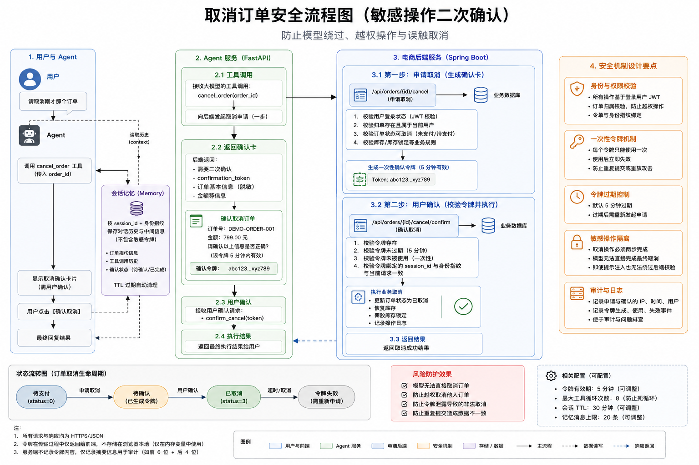

# OrderMate 架构说明

## 系统目标

OrderMate 将电商业务系统和智能客服编排分开：Java 后端控制业务事实、权限与事务，Agent 服务负责自然语言理解、工具选择、会话状态和回答组织。


## 核心组件

| 组件 | 职责 |
| --- | --- |
| 浏览器前端 | 登录、聊天、SSE 时间线和确认卡 |
| FastAPI Agent | 模型调用、工具编排、上下文和安全控制 |
| Spring Boot 后端 | 用户、商品、购物车、订单、权限与事务 |
| MySQL | 持久业务数据和演示知识数据 |
| Redis（可选） | 会话、结构化状态、确认令牌和工作流检查点 |
| 模型服务（live） | 生成工具调用与整理自然语言回答 |

## 请求数据流

```text
浏览器
  -> POST /chat 或 /chat/stream
  -> FastAPI Agent
  -> demo 规则引擎或真实模型
  -> ToolRegistry
  -> Spring Boot API / 本地知识库
  -> 结构化工具结果
  -> Agent 最终回答
```


## 业务边界

- 商品实时价格、库存、购物车和订单以 Java API 返回为准。
- Agent 不直接写 Java 业务表；所有写操作继续通过带鉴权的业务接口。
- 知识库只回答售后、规则、FAQ 和产品说明，不替代结构化业务查询。
- 用户身份由 JWT 表示，Agent 转发令牌但不应记录完整令牌。

## 高风险操作

下单、支付、取消订单等操作先生成短期确认状态，用户批准后才执行。确认状态必须绑定会话和用户身份，且只能使用一次。



## 会话状态

默认未配置 `REDIS_URL` 时，会话历史、结构化状态和确认令牌保存在 Agent 进程内存中，服务重启后丢失。

配置可访问的 Redis 后，可使用 Redis 保存会话和 LangGraph 检查点。当前默认 Docker Compose 不启动 Redis，因此不能把 Redis 持久化描述为默认能力。

## 数据存储

MySQL 中主要业务表包括用户、地址、分类、商品、购物车、订单、订单明细和评价。演示知识表只用于客服规则检索。

项目同时保留 SQLite 开发适配，但 SQLite 文件属于运行产物，不进入 Git。

## 运行模式

- `demo`：确定性规则 Agent，不依赖模型网络。
- `live`：调用 OpenAI-compatible 模型接口。
- `auto`：存在 Key 时使用 live，否则使用 demo。

## 生产化缺口

- 引入 Flyway 或 Liquibase 管理数据库版本。
- 部署独立 Redis 并验证故障恢复。
- 建立真实备份与恢复演练。
- 增加限流、监控、告警和集中日志。
- 对 live 模式做模型兼容性、成本和延迟测试。
