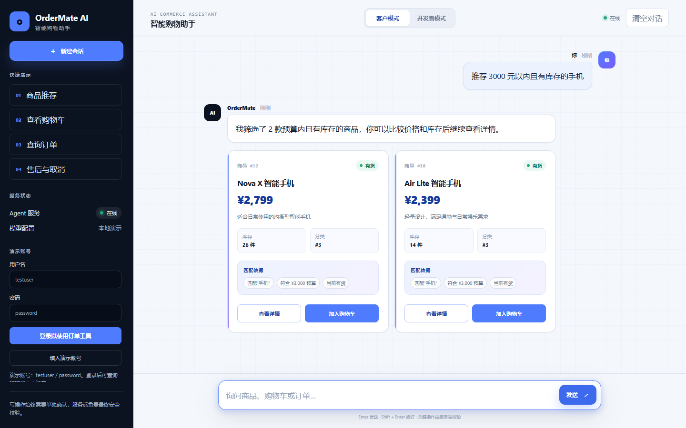
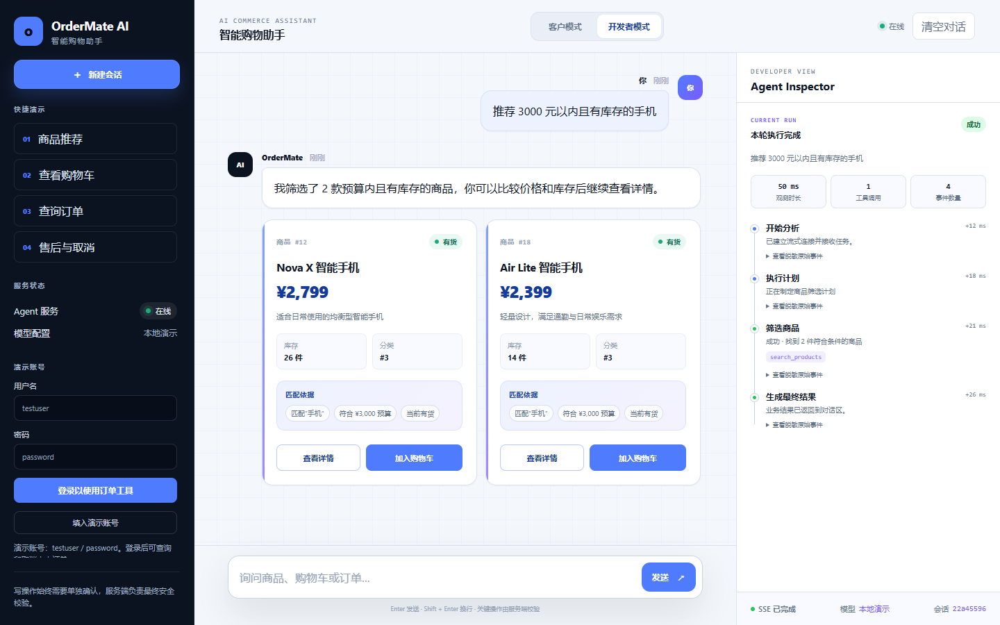

# OrderMate 前端设计与面试演示

## 设计目标

前端采用高级、简约的科技商务风格，使用深海军蓝、冷白、科技蓝和 AI 紫建立视觉层级。页面不依赖框架、外部字体或商品图片，所有商品卡片只展示业务接口返回的真实字段，避免为了视觉效果引入虚构参数或图片爬取链路。

界面保持一个应用、两个视角：

- 客户视角默认启用，只呈现业务语言、商品、购物车、订单和确认结果。
- 开发者视角使用右侧 Agent Inspector 展示 SSE 时间线、工具名、脱敏参数和执行结果。

Inspector 中的时长是浏览器观测时间，不等同于服务端逐工具执行耗时。密码、令牌、Cookie、授权头和 API Key 等敏感字段会递归脱敏。

## 成品界面

客户视角默认隐藏内部工具细节，以商品比较和下一步业务操作为核心：



开发者视角在不打断业务对话的前提下提供独立执行时间线：



## 五分钟面试演示路线

1. 打开首页，说明项目采用 Java 业务后端、FastAPI Agent 和原生前端的分层架构。
2. 在客户视角搜索预算范围内的商品，强调卡片无图片依赖、不编造规格，并展示匹配依据和库存状态。
3. 使用演示账号登录，依次展示购物车和订单卡片。
4. 发起取消订单或清空购物车，展示高风险操作确认、一次性确认令牌和失败防重复策略。
5. 切换到开发者视角，解释 SSE 时间线、业务步骤、工具参数脱敏和客户视角的技术细节隔离。

推荐演示问题：

```text
推荐 3000 元以内的手机
查看我的购物车
查询我的最近订单
取消订单 1
```

## 可重点讲解的工程决策

| 决策 | 价值 |
| --- | --- |
| 客户/开发者双视角 | 同时兼顾真实用户体验和 Agent 调试效率 |
| 商品卡片无图片依赖 | 不增加爬虫、版权、失效链接和数据匹配成本 |
| 事实字段驱动渲染 | 价格、库存、状态均以业务 API 为准 |
| 高风险操作独立确认 | 防止模型直接执行支付、取消和清空操作 |
| Inspector 递归脱敏 | 调试能力不会以泄露令牌和密码为代价 |
| 原生 HTML/CSS/JS | 保持部署简单、静态资源小、面试时容易讲清楚 |
| 请求取消与防旧流回写 | 清空或退出时不会让旧请求污染新会话 |

## 响应式与无障碍

- 桌面端使用侧栏、业务区和 Inspector 三栏结构。
- 中等尺寸下 Inspector 变为右侧抽屉，移动端侧栏也使用抽屉。
- 支持跳过导航、方向键切换视角、Esc 关闭抽屉和焦点恢复。
- 支持读屏器异步状态、系统减少动效偏好和 Windows 高对比度模式。
- 关键触控操作在粗指针设备上保持至少 44px 高度。

## 自动验证

前端契约测试位于 `agent-service/tests/test_frontend_contract.py`，用于守护：

- HTML ID 唯一且 JavaScript DOM 引用存在。
- 页面不引入商品图片或外部静态资源。
- 客户视角不重新出现工具调用轨迹。
- 双视角、Inspector 和无障碍结构保持完整。
- CSS 变量均已定义，样式块完整。
- HTML、CSS、JavaScript 总体积不超过 160 KiB。

运行完整验证：

```powershell
agent-service\.venv\Scripts\python.exe -m pytest -q agent-service\tests
.\mvnw.cmd test
```

## 已知边界

- 默认演示数据不代表真实商品目录。
- 前端不会为缺失字段补造商品规格。
- 真实模型模式受模型服务网络、配额和兼容性影响。
- Inspector 只能展示后端通过 SSE 返回的数据；逐工具服务端耗时需要后端新增时间字段后才能准确展示。
