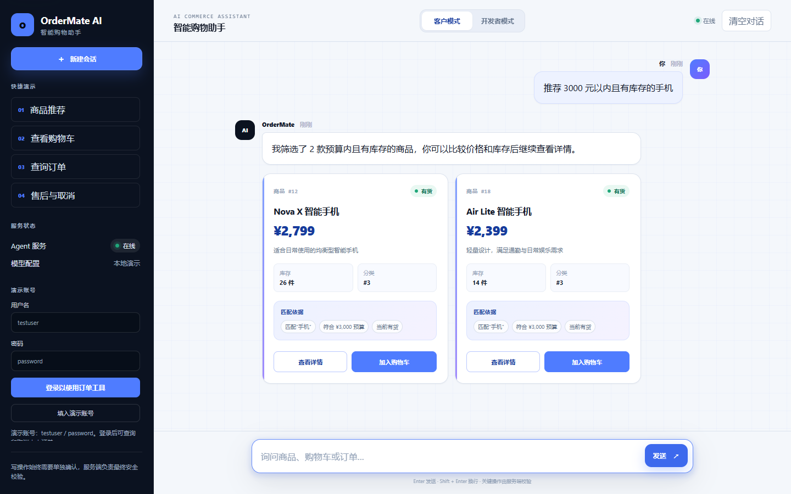
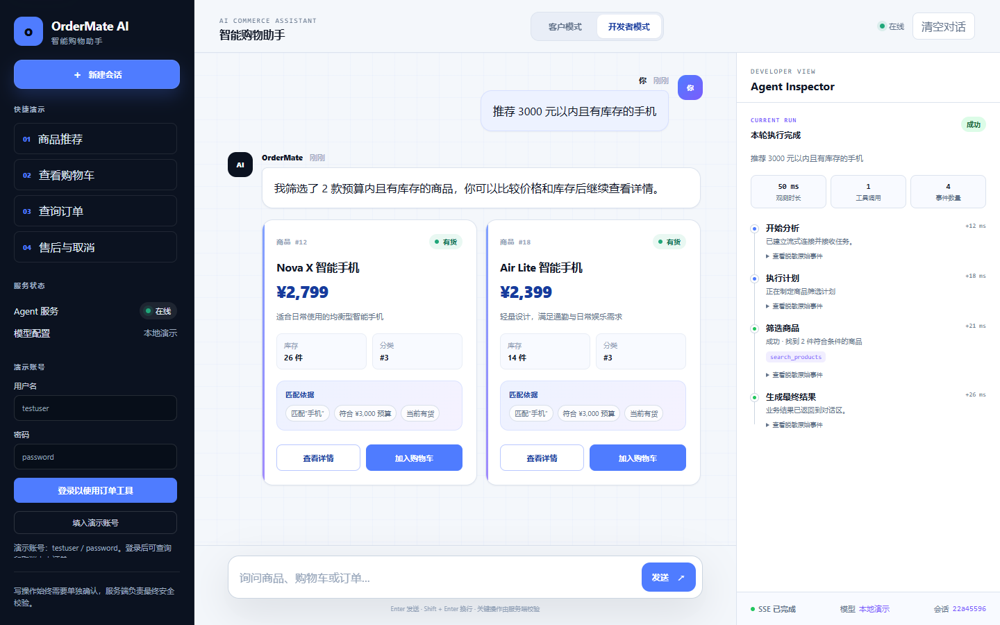

# OrderMate 前端设计与面试演示

## 设计目标

前端采用高级、简约的科技商务风格，使用深海军蓝、冷白、科技蓝和 AI 紫建立视觉层级。页面不依赖外部字体或商品图片，所有商品卡片只展示业务接口返回的真实字段，避免为了视觉效果引入虚构参数或图片爬取链路。

项目目前保留两套可运行前端：`agent-service/app/static/` 是原生 HTML/CSS/JavaScript 回退版本，独立 `frontend/` 目录是 Vue 3 + Vite + TypeScript 新版。Vue 版已经完成最小纵向闭环、业务结果卡片和高风险确认闭环，但尚未切换为公网主入口。Vue 迁移是工程化重构，不代表原生页面是半成品。

界面保持一个应用、两个视角：

- 客户视角默认启用，只呈现业务语言、商品、购物车、订单和确认结果。
- 开发者视角使用右侧 Agent Inspector 展示 SSE 时间线、工具名、脱敏参数和执行结果。

Inspector 中的时长是浏览器观测时间，不等同于服务端逐工具执行耗时。密码、令牌、Cookie、授权头和 API Key 等敏感字段会递归脱敏。

## 目标成品界面

以下截图用于说明完整版本的视觉方向。当前 Vue 版已完成壳层、对话、Inspector、业务结果卡片与确认卡片：

客户视角默认隐藏内部工具细节，以商品比较和下一步业务操作为核心：



开发者视角在不打断业务对话的前提下提供独立执行时间线：



## 当前可演示路线

第二阶段当前可以演示：

1. 打开 Vue 页面，观察 Agent 健康状态与响应式工作台。
2. 登录或恢复已有登录状态，确认 token 只通过 `Authorization` 请求头传递。
3. 输入问题，观察 `started` / `progress` / `result` / `error` 流式状态及文本回答。
4. 中途停止回答或新建会话，说明 AbortController 与旧 `runId` 防回写机制。
5. 切换到开发者视角，查看经过递归脱敏的 SSE 事件时间线。

## 完整版本五分钟面试路线

以下路线的代码与自动化验证已经完成，正式演示前仍需在真实 Java + Agent 环境走一次浏览器手工验收：

1. 打开首页，说明项目采用 Java 业务后端、FastAPI Agent 和独立 Vue 前端的分层架构；原生版本继续作为回退入口。
2. 在客户视角搜索预算范围内的商品，强调卡片无图片依赖、不编造规格，并展示匹配依据和库存状态。
3. 使用演示账号登录，依次展示购物车和订单卡片。
4. 发起取消订单或清空购物车，展示高风险操作确认、一次性确认令牌和失败防重复策略。
5. 切换到开发者视角，解释 SSE 时间线、业务步骤、工具参数脱敏和客户视角的技术细节隔离。

推荐演示问题：

```text
推荐 3000 元以内的手机
查看我的购物车
查询我的最近订单
取消订单 1
```

## 可重点讲解的工程决策

| 决策 | 价值 |
| --- | --- |
| 客户/开发者双视角 | 同时兼顾真实用户体验和 Agent 调试效率 |
| 商品卡片无图片依赖 | 不增加爬虫、版权、失效链接和数据匹配成本 |
| 事实字段驱动渲染 | 价格、库存、状态均以业务 API 为准 |
| 高风险操作独立确认 | 防止模型直接执行支付、取消和清空操作 |
| Inspector 递归脱敏 | 调试能力不会以泄露令牌和密码为代价 |
| 完整 SSE 时间线 | 使用业务名称展示进度、工具、确认和结果，并明确采用浏览器观测时长 |
| Vue 主入口 + 原生回退 | Vue 提供类型、组件和测试能力；原生版本用于对照与快速回滚 |
| 请求取消与防旧流回写 | 清空或退出时不会让旧请求污染新会话 |
| 未识别结果显式降级 | 无法识别的 `data` 使用可折叠原始结果展示，不静默丢失 Agent 返回 |

## 响应式与无障碍

- 桌面端使用侧栏、业务区和 Inspector 三栏结构。
- 中等尺寸下 Inspector 变为右侧抽屉，移动端侧栏也使用抽屉。
- 已支持跳过导航、方向键/Home/End 切换视角、抽屉焦点约束，以及 Esc、遮罩或关闭按钮退出后恢复到原触发控件。
- 读屏器会播报回复完成/停止/失败、待确认操作及确认终态；同时支持系统减少动效偏好和 Windows 高对比度模式。
- 关键触控操作在粗指针设备上保持至少 44px 高度。

## 自动验证

原生前端契约测试位于 `agent-service/tests/test_frontend_contract.py`，继续守护：

- HTML ID 唯一且 JavaScript DOM 引用存在。
- 页面不引入商品图片或外部静态资源。
- 客户视角不重新出现工具调用轨迹。
- 双视角、Inspector 和无障碍结构保持完整。
- CSS 变量均已定义，样式块完整。
- HTML、CSS、JavaScript 总体积不超过 160 KiB。

Vue 版已经建立纯函数、组件、Store 和 SSE 编排测试，目前为 **40 个测试文件 / 141 项常规测试**，另有 **5 项生产产物契约测试**。生产产物 JS 为 **121.85 kB**（gzip **44.66 kB**），CSS 为 **33.13 kB**（gzip **5.72 kB**）；JS + CSS 总量仍低于原始体积 220 KiB、gzip 75 KiB 的预算。

运行完整验证：

```powershell
agent-service\.venv\Scripts\python.exe -m pytest -q agent-service\tests
.\mvnw.cmd test

Set-Location frontend
npm run validate
```

## 当前实施状态（2026-09-27）

- 已完成：接入前置修正、脚手架、类型契约、基础库、设计令牌、API 层、会话状态、健康轮询、SSE 编排、聊天 Store、Inspector 状态和最小响应式界面。
- 自动验证：`vue-tsc`、Vitest 与 Vite 生产构建均通过，开发入口实测返回 HTTP `200`。
- 已完成：商品、购物车、订单结果卡片，以及 8 类高风险操作的确认、拒绝、过期和失败界面；取消操作使用正常中性色反馈。
- 已完成：生产产物无外链、无图片依赖、无内嵌凭据和体积预算的自动门禁，可通过 `npm run validate` 一次执行。
- 已完成：Inspector 完整时间线、业务化工具名称、递归脱敏，以及问题、模型、会话和浏览器观测时长展示。
- 已完成：响应式抽屉的焦点陷阱、关闭后焦点恢复，以及视角标签的完整键盘焦点同步。
- 已完成：回复、停止、错误、待确认和确认结果的统一读屏播报，并消除重复 live region。
- 已完成：Shell/无障碍组件测试，以及登录后由用户明确选择是否继续原操作的等价行为。
- 第三阶段结论：代码与自动化质量工作已经完成，当前为 **40 个测试文件 / 141 项常规测试**及 **5 项产物契约测试**全绿；原生版/Vue 版等价矩阵和有意差异已写入实施计划。
- 待手工验收：在 Java 与 Agent 服务同时运行时走通完整浏览器演示路线。
- 阶段边界：浏览器等价验收完成前，第三阶段不标记为全部完成，也不切换公网主入口。
- 尚未切换：公网主入口和 Nginx/Docker 部署仍保持原计划，原生前端继续可用。

## 与原生版的有意差异

- Vue 版不提供写死演示账号密码的一键填入按钮，避免凭据继续出现在生产前端产物中。
- “取消订单”不放在全局快捷入口，通过订单卡或自然语言发起，降低误触高风险操作的概率。
- 首页快捷问题和部分界面文案经过精简，但搜索、购物车、订单、确认和 Inspector 能力保持等价。
- Vue 尚未成为公网主入口；环境级等价验收完成前，原生页面继续承担回退入口。

## 已知边界

- 默认演示数据不代表真实商品目录。
- `session_id` 只隔离 Agent 会话状态，不隔离 Java 业务数据；共享演示账号的购物车和订单仍可能互相影响。
- 公网环境在完成独立演示账号/数据隔离前，不开放共享账号的下单、支付、取消、退款等写操作；定时重置不能替代隔离。
- 前端不会为缺失字段补造商品规格。
- 真实模型模式受模型服务网络、配额和兼容性影响。
- Inspector 只能展示后端通过 SSE 返回的数据；逐工具服务端耗时需要后端新增时间字段后才能准确展示。
